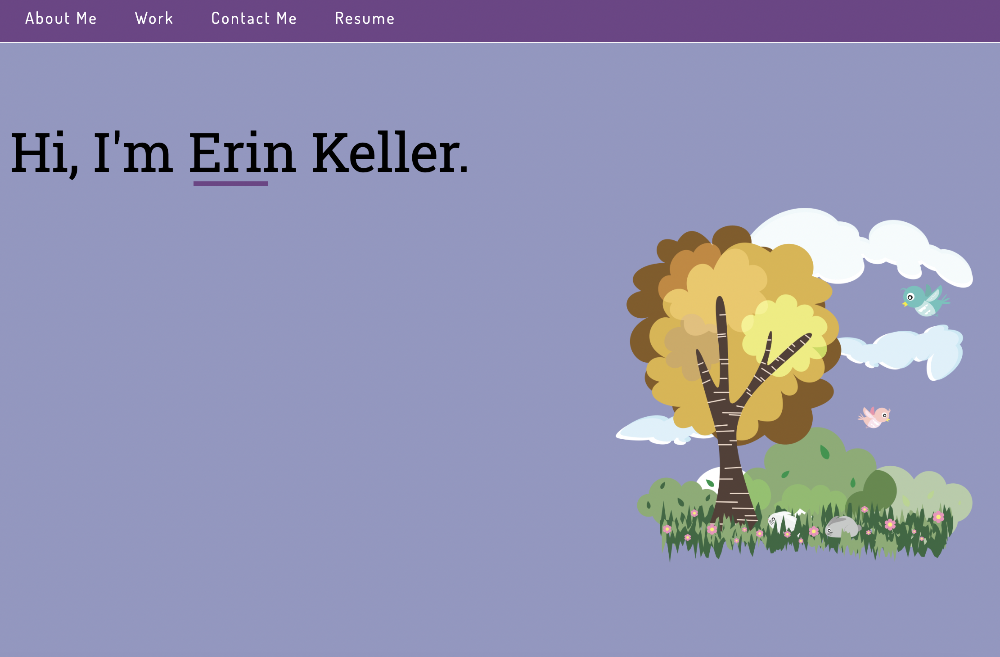

# Portfolio Code

## Description

This project was bootstrapped with [Create React App](https://github.com/facebook/create-react-app).


## Technology Stack


## User Story

```md
AS AN employer
I WANT to view a potential employee's deployed portfolio of work samples
SO THAT I can review samples of their work and assess whether they're a good  
candidate for an open position
```

## Acceptance Criteria

```md
GIVEN I need to sample a potential employee's previous work
WHEN I load their portfolio
THEN I am presented with the developer's name, a recent photo or avatar,  
and links to sections about them, their work, and how to contact them
WHEN I click one of the links in the navigation
THEN the UI scrolls to the corresponding section
WHEN I click on the link to the section about their work
THEN the UI scrolls to a section with titled images of the developer's applications
WHEN I am presented with the developer's first application
THEN that application's image should be larger in size than the others
WHEN I click on the images of the applications
THEN I am taken to that deployed application
WHEN I resize the page or view the site on various screens and devices
THEN I am presented with a responsive layout that adapts to my viewport
```

## Screenshot



## Deployed page

[View Published Page](https://erin-m-keller.github.io/keller-portfolio/)

## License

[MIT](https://choosealicense.com/licenses/mit/)